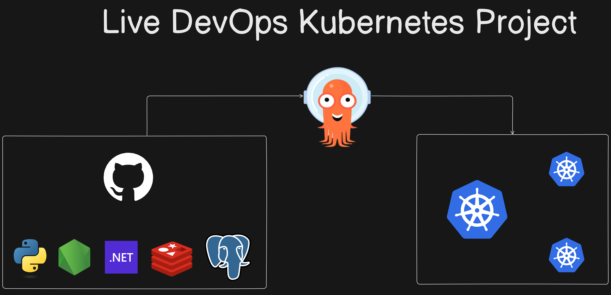
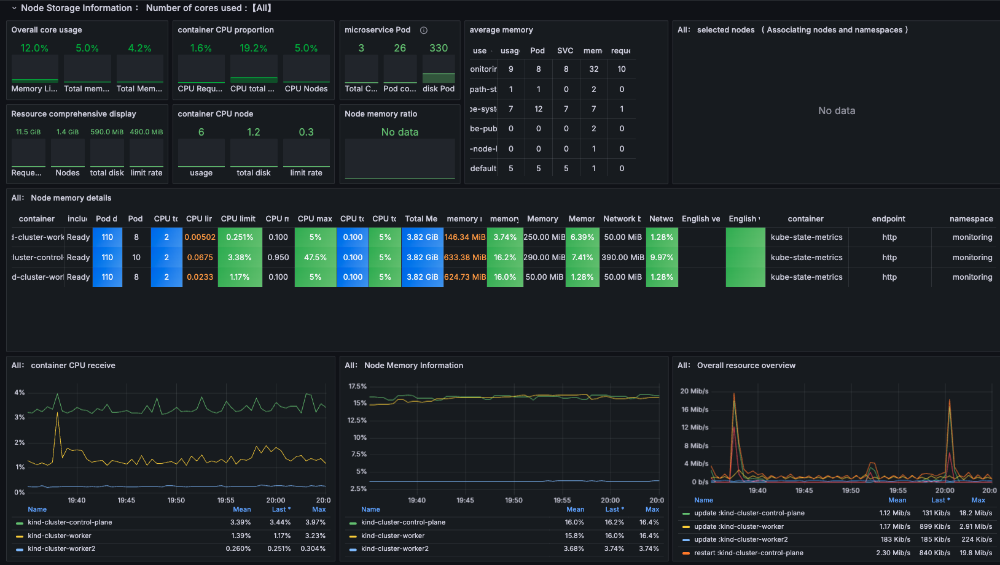
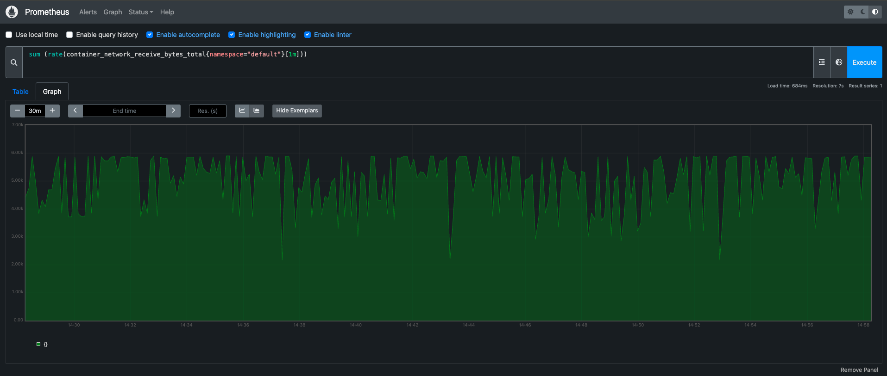

# Kubernetes Kind Voting Application — DevOps Project
Deployed a microservices-based voting application on Kubernetes using Docker and Kind. Configured Kubernetes Deployments, Services, storage, networking, and application components, and performed deployment and troubleshooting using kubectl.

## Technologies Used
Kubernetes | Docker |EC2| Kind | Argo CD | Git | GitHub | Redis | PostgreSQL | Linux | YAML | Observability

## Overview

This guide covers the steps to:
- Launch an AWS EC2 instance.
- Install Docker and Kind.
- Create a Kubernetes cluster using Kind.
- Install and access kubectl.
- Set up the Kubernetes Dashboard.
- Install and configure Argo CD.
- Connect and manage your Kubernetes cluster with Argo CD.

## Architecture

## Voting App

## Voting Result

## GitOps Deployment with Argo CD

## Kubernetes Deployment Verification

## Kubernetes Dashboard - Application Workloads

## Observability

* A front-end web app in [Python](/vote) which lets you vote between two options
* A [Redis](https://hub.docker.com/_/redis/) which collects new votes
* A [.NET](/worker/) worker which consumes votes and stores them in…
* A [Postgres](https://hub.docker.com/_/postgres/) database backed by a Docker volume
* A [Node.js](/result) web app which shows the results of the voting in real time

### Project Title: 

Automated Deployment of Scalable Voting Applications on AWS EC2 with Kubernetes and Argo CD

### Description: 

Led the deployment of scalable applications on AWS EC2 using Kubernetes and Argo CD for streamlined management and continuous integration. Orchestrated deployments via Kubernetes dashboard, ensuring efficient resource utilization and seamless scaling.

### Key Technologies:

* AWS EC2: Infrastructure hosting for Kubernetes clusters.
* Kubernetes Dashboard: User-friendly interface for managing containerized applications.
* Argo CD: Continuous Delivery tool for automated application deployments.

### Achievements:

Implemented Kubernetes dashboard for visual management of containerized applications on AWS EC2 instances.
Utilized Argo CD for automated deployment pipelines, enhancing deployment efficiency by 60%.
Achieved seamless scaling and high availability, supporting 99.9% uptime for critical applications.
This project description emphasizes your role in leveraging AWS EC2, Kubernetes, and Argo CD to optimize application deployment and management processes effectively.

### Author (Irfan Ahmad)
### [https://github.com/Irfan-devops1]

